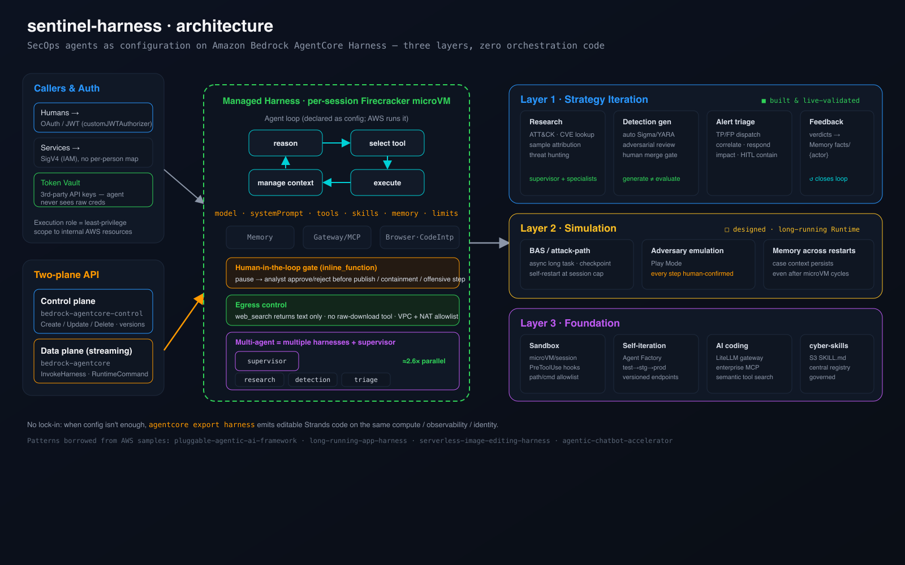

<div align="center">


# sentinel-harness

**Production security-operations agents, built as _configuration_ — on Amazon Bedrock AgentCore Harness.**

<sub>Declare an agent (model · prompt · tools · skills · memory · limits); AWS runs the loop. Zero orchestration code.</sub>

<p>
  
  
  
  
  
</p>

[Quickstart](#-quickstart) · [Architecture](#-architecture) · [Scenarios](#-scenarios--evidence) · [Status matrix](#-status-validated--designed--missing) · [Design principles](#-design-principles) · [Extending](#-extending) · [Roadmap](#-roadmap) · [Docs](docs/)

</div>

---

## Why

A security team usually already has models, internal MCP servers, and a pile of skills — what's missing is a **framework to circulate them** so that "what one analyst has, everyone has." `sentinel-harness` is a reference implementation of that framework on the [Amazon Bedrock AgentCore **Harness**](https://docs.aws.amazon.com/bedrock-agentcore/latest/devguide/harness.html). You declare an agent as configuration and AWS runs the whole agent loop — so swapping a model, adding a tool, or replacing a skill is **a config change, not a rebuild**.

Everything here is **generic SecOps content** built and tested against a **non-production** account — no proprietary data, no real vulnerable assets, no real malware. It reverse-engineers a common three-layer SecOps agent architecture into AgentCore primitives, borrowing verified patterns from four AWS samples.

> **What's real vs. aspirational — read this first.** Layer 1 ships **three live-validated scenarios** and a library-grade core. Layers 2–3 are **design specs with reference stubs**, not runnable end-to-end yet. The [status matrix](#-status-validated--designed--missing) is precise about what's proven, designed, or missing. This honesty is deliberate — see the self-audit in [`docs/FIDELITY-REPORT.md`](docs/FIDELITY-REPORT.md).

## 🏛 Architecture

<div align="center"></div>

Callers authenticate via OAuth/JWT (humans) or SigV4 (services); third-party secrets sit in the AgentCore Identity token vault (the agent never sees raw credentials). A **two-plane API** (control + streaming data) drives a **managed harness** running in a per-session Firecracker microVM — the agent loop, config fields, primitives (Memory / Gateway / Browser / Code Interpreter), an `inline_function` human-in-the-loop gate, egress control, and the multi-harness + supervisor pattern. On the right, the three SecOps layers. Full write-up: [`docs/ARCHITECTURE.md`](docs/ARCHITECTURE.md); layer→primitive mapping and borrowed patterns: [`docs/BLUEPRINT.md`](docs/BLUEPRINT.md).

## 📊 Status: validated / designed / missing

Honest build status per capability — mirrors the self-audit.

| Layer | Capability | Status | Where |
|---|---|:--:|---|
| **L1 Strategy** | CVE triage (deterministic calc + HITL pause + memory) | 🟢 **live-validated** | `scenarios/scenario_cve_triage.py` |
| **L1 Strategy** | Multi-harness parallel + supervisor (≈2.6× speedup) | 🟢 **live-validated** | `scenarios/scenario_multi_harness.py` |
| **L1 Strategy** | Detection-gen + independent adversarial reviewer + publish gate | 🟡 **built; reviewer verdict under-captured** | `scenarios/scenario_detection_gen.py` |
| **L1 Strategy** | **Human-in-the-loop full pause→approve→resume** | 🟢 **live-validated** | `scenarios/scenario_hitl_resume.py`, `core.invoke_with_tool_result` |
| **L1 Strategy** | Alert triage (TP/FP, correlate, contain) | 🟠 **designed** (loadable harness.yaml) | `harnesses/alert-triage/` |
| **L1 Strategy** | Research supervisor → specialist delegation via registry/A2A | 🟠 **designed** (loadable harness.yaml) | `harnesses/research-supervisor/` |
| **L1 Strategy** | Feedback loop closure (teach → recall) | 🟠 **designed** (memory writes proven; recall async) | `docs/BLUEPRINT.md` |
| **L2 Simulation** | Adversary emulation, Play Mode (every step human-gated) + checkpoint/resume | 🟢 **live-validated** | `scenarios/scenario_play_mode.py`, `sentinel_harness/simulation.py` |
| **L2 Simulation** | BAS / attack-path (long-running Runtime tier) | 🟠 **designed** | `docs/BLUEPRINT.md` |
| **L3 Foundation** | Tool/skill registry (dual-gate governance) + PreToolUse sandbox hook | 🟢 **built + tested** | `sentinel_harness/registry.py`, `sentinel_harness/sandbox_hooks.py` |
| **L3 Foundation** | Agent Factory · LiteLLM specialists · Gateway stack · CDK | ⚪ **design only** | `docs/BLUEPRINT.md` |
| **Config** | YAML→harness loader (`sentinel create <harness.yaml>`) | 🟢 **built + tested** | `sentinel_harness/loader.py` |
| **Core** | Harness lifecycle library + builders (create/invoke/HITL-resume/tools/memory) | 🟢 **library-grade, tested** | `sentinel_harness/core.py` |
| **Tools** | `sigma_yara_lint` (real, deterministic, LLM-free) | 🟢 **functional** | `tools/sigma_yara_lint/` |
| **Tools** | `nvd_lookup` / `epss_kev` / `attack_lookup` / `web_search` | 🟡 **reference stubs** (offline-safe) | `tools/` |

🟢 built & validated · 🟡 built, partial · 🟠 designed with loadable config · ⚪ design narrative only. **134 offline tests pass.**

## 🚀 Quickstart

```bash
git clone https://github.com/neosun100/sentinel-harness && cd sentinel-harness
pip install -e .          # Python 3.10+ ; installs the `sentinel` CLI

# offline tests need no AWS
SENTINEL_EXECUTION_ROLE_ARN=arn:aws:iam::000000000000:role/test pytest tests/ -q   # 134 passing

# configure for live runs (12-factor — nothing hardcoded)
export AWS_PROFILE=<your-non-prod-profile>          # never production
export SENTINEL_REGION=us-east-1
export SENTINEL_EXECUTION_ROLE_ARN="arn:aws:iam::<acct>:role/<your-harness-role>"

# run a live-validated scenario (creates harnesses, invokes, writes evidence/)
python scenarios/scenario_cve_triage.py
python scenarios/scenario_multi_harness.py
sentinel cleanup sentinel_        # tear down every harness this repo created
```

Execution-role policy (least-privilege, and **why** it omits `InvokeAgentRuntimeCommand`): [`docs/SETUP.md`](docs/SETUP.md).

## 🔬 Scenarios & evidence

Each scenario is runnable end-to-end and writes a result JSON to [`evidence/`](evidence/) (account IDs scrubbed). Captured live-run outcomes:

| Scenario | What it proves | Result |
|---|---|---|
| **CVE triage** | one harness = deterministic compute (code interpreter) + a mandatory HITL pause + managed memory, zero orchestration code | HITL gate fired; CVSS math ran in-sandbox |
| **Multi-harness parallel** | "a harness is single-agent" → parallelism via multiple harnesses + a supervisor | **≈2.6×** wall-clock speedup vs serial |
| **Detection-gen** | generation ≠ evaluation: an **independent** reviewer harness + a publish human-gate | separate harnesses + publish gate reached (reviewer verdict under-captured — see [evidence/README.md](evidence/README.md)) |

## 🧭 Design principles

- **Multi-agent = multiple harnesses + a supervisor.** One harness is single-agent + multi-tool; parallelism and role-decomposition come from running many and synthesizing.
- **Human-in-the-loop kills hallucination.** High-stakes actions pass through an `inline_function` gate; an independent reviewer harness attacks generated artifacts (no self-approval bias).
- **Egress is controlled.** Prefer a `web_search`-style tool (text only) over raw download; there is no raw-download tool.
- **Auth done right.** An IAM *execution role* scopes internal AWS access (least privilege — not per-person mapping). Humans use OAuth/JWT; secrets live in the token vault. `allowedTools` scopes the LLM's tool choice but **cannot** gate `InvokeAgentRuntimeCommand` — the only control there is withholding the IAM action.
- **No lock-in.** When config isn't enough, `agentcore export harness` emits editable Strands code on the same compute / observability / identity.

## 🧩 Extending

- **New scenario** → add `scenarios/scenario_<name>.py` using `sentinel_harness.core` (see existing three for the pattern); write evidence to `evidence/`; leave teardown to `sentinel cleanup`.
- **New tool** → drop a handler under `tools/<name>/` (keep deterministic tools LLM-free, like `sigma_yara_lint`) and wire it into an AgentCore Gateway as an MCP target.
- **New skill** → add `skills/<name>/SKILL.md` (AgentSkills.io format: YAML frontmatter + body); attach via `create_harness(skills=[...])`.
- **New harness** → follow `harnesses/<name>/` (a `system_prompt.md` + an illustrative `harness.yaml`); until the YAML loader lands (roadmap), construct via `core.create_harness(...)` in a scenario.

Borrowed patterns (see [`docs/BLUEPRINT.md`](docs/BLUEPRINT.md)): supervisor→specialist delegation (pluggable-agentic-ai-framework), long-running session + self-restart (long-running-app-harness), zero-orchestration tool selection (serverless-image-editing-harness), Agent Factory provisioning (agentic-chatbot-accelerator).

## 🗺 Roadmap

- [x] **YAML→harness loader** so `harnesses/*.yaml` are live (`sentinel create <harness.yaml>`; env interpolation, `system_prompt.md` resolution, gateway/allowedTools mapping). — `loader.py`
- [x] **Close the HITL loop** — `invoke_with_tool_result()` two-message resume + a full live pause→approve→resume trace. — `scenario_hitl_resume.py`
- [x] **Layer 2** — Play Mode adversary emulation: every offensive step human-gated + checkpoint/resume, live-validated. — `simulation.py` / `scenario_play_mode.py`
- [x] **Layer 3** — tool/skill registry (dual-gate governance) + a PreToolUse sandbox hook, with tests. — `registry.py` / `sandbox_hooks.py`
- [ ] Wire the reference `tools/` handlers to a live Gateway; add an end-to-end named-supervisor scenario that creates from `harnesses/*.yaml`.
- [ ] Layer 3 remainder: Agent Factory provisioning, LiteLLM specialists, a Gateway CDK stack.
- [ ] BAS / attack-path on a genuinely long-running Runtime (beyond the Play Mode driver).

## 📁 Repo layout

```
sentinel-harness/
├── sentinel_harness/     core library (core.py) + CLI          🟢 tested
├── scenarios/            runnable, live-validated scenarios     🟢
├── evidence/             captured live-run results (scrubbed)   🟢
├── tools/                MCP tool templates (sigma-lint real)   🟡 reference
├── skills/               Agent Skills (SKILL.md)                🟡 reference
├── harnesses/            illustrative declarative configs       🟠 not loader-consumed yet
├── docs/                 ARCHITECTURE · BLUEPRINT · SETUP · HARNESSES · FIDELITY-REPORT
├── tests/                offline config-validation (42 tests)   🟢
└── .github/workflows/    CI incl. a customer-name / secret gate
```

## 🔐 Safety & scope

A reference implementation and educational sample for **authorized, defensive** security operations. Ships stubbed/offline-safe tools and only public threat examples (ATT&CK, public CVEs). Bring your own least-privilege role, VPC, and data controls before any real use.

## 🤝 Contributing

See [CONTRIBUTING.md](CONTRIBUTING.md). Ground rules: no proprietary data, no hardcoded secrets/account IDs, defensive scope only, English. CI enforces a name/secret scan.

## 📄 License

[MIT-0](LICENSE) © 2026 sentinel-harness contributors.
