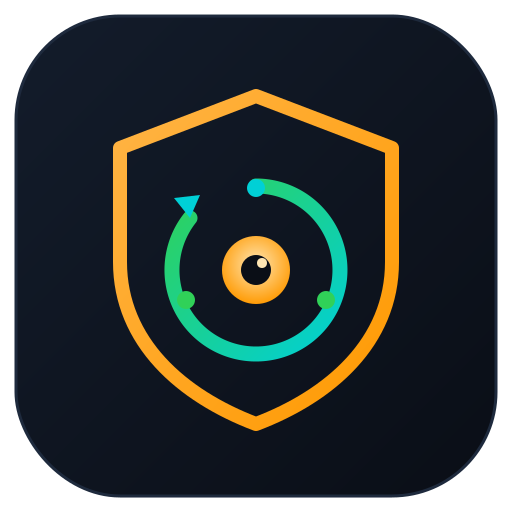
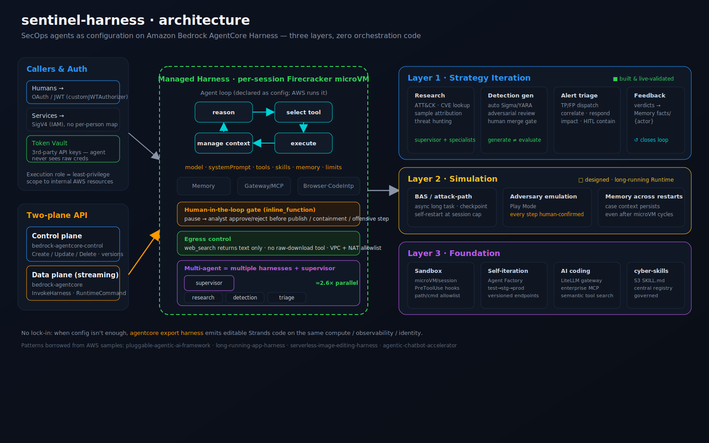
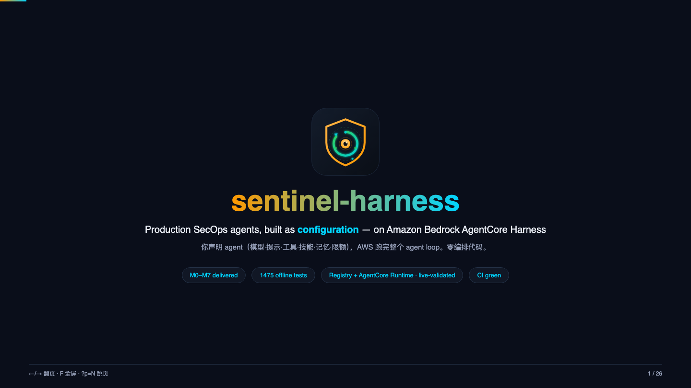

<div align="center">



# sentinel-harness

**Production security-operations agents, built as _configuration_ — on Amazon Bedrock AgentCore Harness.**

<sub>Declare an agent (model · prompt · tools · skills · memory · limits); AWS runs the loop. Zero orchestration code.</sub>

<p>
  
  
  
  
  
  
  
  
  
  <a href="https://neosun100.github.io/sentinel-harness/"></a>
</p>

[Quickstart](#-quickstart) · [Architecture](#-architecture) · [Live on AWS](#-live-validated-on-aws) · [Scenarios](#-scenarios--evidence) · [Status matrix](#-status-validated--designed--missing) · [API reference](https://neosun100.github.io/sentinel-harness/) · [Docs map](#-documentation-map) · [Roadmap](#-roadmap)

</div>

---

## Why

**The thesis: a production SecOps agent should be *configuration*, not orchestration code.** You declare an agent — model · prompt · tools · skills · memory · limits — and AWS runs the entire agent loop for you. Swapping a model, adding a tool, or replacing a skill becomes a **config change, not a rebuild**.

A mature security team usually already owns the pieces — models, internal MCP servers, a pile of analyst skills. What's missing is a **framework to circulate them** so that "what one analyst has, everyone has." `sentinel-harness` is a reference implementation of that framework on the [Amazon Bedrock AgentCore **Harness**](https://docs.aws.amazon.com/bedrock-agentcore/latest/devguide/harness.html): it reverse-engineers a common three-layer SecOps agent architecture (Strategy / Simulation / Foundation) into AgentCore primitives, borrowing verified patterns from four AWS samples.

Everything here is **generic SecOps content** built and tested against a **non-production** account — no proprietary data, no real vulnerable assets, no real malware. Delivered across milestones **M0–M12**, with the full `[EXTERNAL]` live-proof set — Registry, AgentCore Runtime A2A, CUSTOM_JWT gateway, managed + online Evaluate, cross-session Memory recall, and the end-to-end self-improvement closed loop — **live-validated on AWS** (see below). Full API reference: <https://neosun100.github.io/sentinel-harness/>.

> **What's real vs. aspirational — read this first.** Layer 1 ships **live-validated scenarios** (including a real Gateway create→READY→delete on the GA API) and a library-grade core. Layer 2 Play Mode is live-validated, BAS detection-replay is real (a deterministic Sigma matcher finds detection blind spots offline), and sample detonation is a built+tested full-lifecycle orchestrator that stays an **honest SIMULATED no-op** (no real malware/VM/network — sample-by-reference, sandbox-refused actions, HITL-gated, always destroyed after use). Layer 3 ships a built+tested tool/skill registry, sandbox hooks, and Agent Factory; a dual-track IaC foundation (CDK + a `terraform validate`-clean Terraform mirror) where the Guardrail, Cognito JWT identity, and CloudWatch/Budgets observability stacks are **live-deployed and validated on a real dev account** (a Guardrail really masked a fake AWS key; the private-VPC PrivateLink endpoints stay cost-gated off); plus an A2A specialist container that really `docker build`s (pinned deps, non-root) with a mocked-model zero-network contract test. The four core data-plane tools (`siem_query`/`asset_lookup`/`enrich_ioc`/`ops_query`) are backend-pluggable: offline mock by default, a real stdlib-HTTP client behind a `*_LIVE` env, so connecting a real backend is a config change, not a rebuild. The [status matrix](#-status-validated--designed--missing) is precise about what's proven, built, designed, or skeleton — 🟡 rows are honest about their limits. This honesty is deliberate — see the self-audit in [`docs/FIDELITY-REPORT.md`](docs/FIDELITY-REPORT.md).

## 🏛 Architecture

<div align="center"></div>

Callers authenticate via OAuth/JWT (humans) or SigV4 (services); third-party secrets sit in the AgentCore Identity token vault (the agent never sees raw credentials). A **two-plane API** (control + streaming data) drives a **managed harness** running in a per-session Firecracker microVM — the agent loop, config fields, primitives (Memory / Gateway / Browser / Code Interpreter), an `inline_function` human-in-the-loop gate, egress control, and the multi-harness + supervisor pattern. On the right, the three SecOps layers. Full write-up: [`docs/ARCHITECTURE.md`](docs/ARCHITECTURE.md); layer→primitive mapping and borrowed patterns: [`docs/BLUEPRINT.md`](docs/BLUEPRINT.md).

### ✅ Live-validated on AWS

Not just synthesized — these were exercised against real AgentCore/AWS APIs on a **non-production dev/test account** (every committed account ID scrubbed to `000000000000`), then torn down:

| Proof | What actually ran on-account | Evidence |
|---|---|---|
| **AgentCore Runtime + A2A** | `CreateAgentRuntime` → real `arm64` microVM (PUBLIC net, A2A) → live A2A `message/send` **HTTP 200** → real Bedrock Haiku → Log4Shell verdict (CVSS 10.0); torn down after | [`evidence/live_a2a_runtime_result.json`](evidence/live_a2a_runtime_result.json) |
| **AgentCore Registry governance** | real Registry + `AGENT_SKILLS` record created, then moved `DRAFT`→`PENDING_APPROVAL` (`autoApproval=false` dual-gate) | [`evidence/registry_governance_result.json`](evidence/registry_governance_result.json) |
| **Gateway lifecycle** | Gateway create→`READY`→delete on the GA API | [`evidence/gateway_lifecycle_result.json`](evidence/gateway_lifecycle_result.json) |
| **Guardrail** | `GUARDRAIL_INTERVENED` masked a fake AWS key + token in a tool response | [`evidence/m4_guardrail_result.json`](evidence/m4_guardrail_result.json) |
| **Cognito CUSTOM_JWT identity** | OIDC discovery reachable, JWKS RS256, authorizer contract verified | [`evidence/m4_live_deploy_result.json`](evidence/m4_live_deploy_result.json) |
| **Private-VPC default-deny egress** | topology proves no IGW / no NAT / no `0.0.0.0/0` — PrivateLink-only; endpoints then torn down (cost-gated) | [`evidence/egress_control_result.json`](evidence/egress_control_result.json) |
| **CUSTOM_JWT gateway (end-to-end)** | Cognito OIDC (M2M) → live gateway accepts a real RS256 token (HTTP 200) + rejects no/garbage token (401); a Lambda MCP tool invoked *through* the JWT gateway | [`evidence/live_custom_jwt_gateway_result.json`](evidence/live_custom_jwt_gateway_result.json) |
| **Managed Evaluate — on-demand + online** | SESSION LLM-judge ACTIVE; plus an `OnlineEvaluationConfig` scoring 100% of GenAI sessions from Transaction Search `aws/spans` with Builtin Faithfulness/Harmfulness/Coherence | [`live_managed_evaluator_result.json`](evidence/live_managed_evaluator_result.json) · [`live_online_evaluation_result.json`](evidence/live_online_evaluation_result.json) |
| **M12 closed loop (`closed:true`)** | weak agent scored 0.0 → improve → re-scored 1.0 → real `loop_safety` veto + regression guard → HITL-approve → `CreateHarnessEndpoint` promote → reject-path withholds | [`evidence/closed_loop_result.json`](evidence/closed_loop_result.json) |
| **Cross-session Memory recall + isolation** | 4 sessions under `tenant-1` → async SEMANTIC extraction → cross-session recall (top score 0.52); `tenant-2` recalls **0** (hard multi-tenant isolation) | [`live_memory_recall_result.json`](evidence/live_memory_recall_result.json) · [`live_memory_isolation_result.json`](evidence/live_memory_isolation_result.json) |

**Honest note on what is *not* yet proven:** a full `cdk deploy` of the Registry/Runtime raw-`CfnResource` stacks fails until those CFN types are GA *and* the `bedrock-agentcore-control` SDK client is bundled into the Lambda asset (the control-plane APIs themselves are live-verified above); wiring the `*_LIVE` tool seams to a real SIEM / asset / IOC / ticketing backend needs a customer account; detonation is an honest **SIMULATED no-op** (no real malware / VM / network). The M12 loop is **runner-orchestrated** (the agent-authored-orchestration variant is future work); the invoke data plane is reached with a fresh in-account role assumed directly (the credential-vending session policy — not a service gate — is what blocks the federated caller, so a direct role assume unblocks it); OTEL span emission from code is a documented future item (the managed online-eval path over Transaction Search is proven above).

## 📊 Status: validated / designed / missing

Honest build status per capability — mirrors the self-audit.

| Layer | Capability | Status | Where |
|---|---|:--:|---|
| **L1 Strategy** | CVE triage (deterministic calc + HITL pause + memory) | 🟢 **live-validated** | `scenarios/scenario_cve_triage.py` |
| **L1 Strategy** | Multi-harness parallel + supervisor (≈2.6× speedup) | 🟢 **live-validated** | `scenarios/scenario_multi_harness.py` |
| **L1 Strategy** | Detection-gen + independent adversarial reviewer + publish gate | 🟢 **live-validated** (independent reviewer reached `revise`; flawed rule withheld; no stray shell) | `scenarios/scenario_detection_gen.py` |
| **L1 Strategy** | **Human-in-the-loop full pause→approve→resume** | 🟢 **live-validated** | `scenarios/scenario_hitl_resume.py`, `core.invoke_with_tool_result` |
| **L1 Strategy** | Alert triage (TP/FP, correlate, contain) | 🟠 **designed** (loadable harness.yaml) | `harnesses/alert-triage/` |
| **L1 Strategy** | Gateway wiring + end-to-end named-supervisor scenario | 🟢 **live-validated** (real Gateway create→READY→delete on GA API — `evidence/gateway_lifecycle_result.json`; named-supervisor loads from `harness.yaml`) | `sentinel_harness/gateway.py`, `scenarios/scenario_named_supervisor.py` |
| **L1 Strategy** | Research supervisor → specialist delegation via registry/A2A | 🟠 **designed** (loadable harness.yaml; A2A specialist skeleton) | `harnesses/research-supervisor/`, `specialists/cve-intel/` |
| **L1 Strategy** | Feedback loop closure — disposition auto-feeds strategy | 🟢 **live-validated** (offline, deterministic; FP batch auto-triggers whitelist optimization that preserves the TP + a rule-regen task, HITL-gated — `evidence/feedback_loop_result.json`) | `sentinel_harness/feedback.py`, `tools/whitelist_optimizer/`, `scenarios/scenario_feedback_loop.py` |
| **L1 Strategy** | CVE triage against the asset plane (id → NVD+EPSS/KEV → asset → blast radius → HITL) | 🟢 **validated** (offline, deterministic MOCK; Log4Shell → `web-01` affected + blast radius, KEV-exploited, HITL-gated — `evidence/cve_asset_triage_result.json`) | `scenarios/scenario_cve_asset_triage.py`, `tools/{nvd_lookup,epss_kev,asset_lookup}/` |
| **L1 Strategy** | Multi-account ops automation (enumerate accounts → triage findings → ticket, HITL) | 🟠 **designed** (loadable harness.yaml over a fictional 4-account inventory; read-only `ops_query`, `OPS_QUERY_LIVE` seam) | `harnesses/ops-automation/`, `tools/ops_query/`, `mockdata/accounts.py` |
| **L2 Simulation** | Adversary emulation, Play Mode (every step human-gated) + checkpoint/resume | 🟢 **live-validated** | `scenarios/scenario_play_mode.py`, `sentinel_harness/simulation.py` |
| **L2 Simulation** | BAS detection-replay + blind-spot report (real Sigma matcher) | 🟢 **live-validated** (offline, deterministic; 4 techniques × 2 rules → 2 blind spots, coverage 0.5) | `tools/sigma_match/`, `longrunning/bas-runner/bas_cases.py`, `scenarios/scenario_bas_replay.py` |
| **L2 Simulation** | Attack-path reasoning + threat-hunt planning | 🟢 **built + tested** (real `build_attack_paths` / `build_hunt_plan`; both siblings now at cve-intel parity — two-stage docker build, non-root, + a mocked-model zero-network A2A message/send contract test) | `specialists/attack-mapper/`, `specialists/threat-hunt/`, `tools/asset_lookup/` |
| **L2 Simulation** | Sample detonation (one-shot microVM, long-running tier) | 🟢 **built + tested** (full `QUEUED→…→DESTROYED` lifecycle state machine + `detonate_sample` orchestrator + scenario; HONEST SIMULATED no-op — no real VM/malware/network; sample-by-reference, sandbox-refused bad action, HITL-gated, always-destroyed-after-use — `evidence/detonation_result.json`) | `longrunning/detonation/`, `scenarios/scenario_detonation.py` |
| **L3 Foundation** | Tool/skill registry (dual-gate governance) + PreToolUse sandbox hook | 🟢 **built + tested** | `sentinel_harness/registry.py`, `sentinel_harness/sandbox_hooks.py` |
| **L3 Foundation** | Agent Factory (fleet provision, dry-run, cross-env tag-guard) | 🟢 **built + tested** | `sentinel_harness/factory.py` |
| **L3 Foundation** | LiteLLM A2A specialist Runtime (container) | 🟢 **built + tested** (real multi-stage `Dockerfile` with pinned deps + non-root `docker build` succeeds; in-process A2A server↔client contract test with a **mocked** model + socket-connect guard proves zero-network round-trip + clean errors on malformed input) | `specialists/cve-intel/` (`Dockerfile`, `compose.yaml`, `local_a2a.py`) |
| **L3 Foundation** | AgentCore Registry control-plane governance (create Registry + records; DRAFT→PENDING_APPROVAL dual-gate) | 🟢 **live-verified** (a real Registry + an `AGENT_SKILLS` record were created on a non-prod dev account and moved `DRAFT` → `PENDING_APPROVAL` via `submit_for_approval`; `autoApproval=false` = the on-account realization of the offline dual-gate. `registry_live.py` wraps the confirmed-real `bedrock-agentcore-control` Registry ops; the governance walk is proven offline in `evidence/registry_governance_result.json`) | `sentinel_harness/registry_live.py`, `scenarios/scenario_registry_governance.py` |
| **L3 Foundation** | Gateway/Registry/Memory CDK stack | 🟡 **synth-validated** (Gateway/Memory CFN types registered; the Registry type has a feature-flagged Lambda-backed custom-resource *path* — `-c sentinel:registryViaCustomResource=true`, tsc + both-state synth clean. The Lambda's Registry action names are now **confirmed** real against the GA model, but the `@aws-sdk/client-bedrock-agentcore-control` client is **not** in the Node20 bundled set / `package.json`, so it must be bundled before a live `cdk deploy` — no live CDK deploy has run) | `iac-cdk/lib/registry-stack.ts`, `iac-cdk/lib/registry-cr.ts` |
| **L3 Foundation** | Runtime CDK stack (specialist / long-running Runtime) | 🟡 **synth-validated** (raw `AWS::BedrockAgentCore::Runtime` CfnResource — PUBLIC net + A2A protocol + arn/id outputs; tsc + `cdk synth` clean, mirrors the registry-stack honesty pattern. The CFN type is not GA so it synths but fails on deploy until registered; the control-plane `CreateAgentRuntime` itself is separately **live-validated** — see the live-A2A row) | `iac-cdk/lib/runtime-stack.ts` |
| **L3 Foundation** | Guardrail — masks secrets/PII in tool responses | 🟢 **live-deployed + validated** (`GUARDRAIL_INTERVENED` masked a fake AWS key + token) | `iac-cdk/lib/guardrail-stack.ts`, `evidence/m4_guardrail_result.json` |
| **L3 Foundation** | Cognito identity for Gateway CUSTOM_JWT (human + M2M) | 🟢 **live-deployed** (OIDC discovery reachable, RS256; authorizer contract verified) | `iac-cdk/lib/identity-stack.ts`, `gateway.cognito_jwt_authorizer` |
| **L3 Foundation** | Observability — CW dashboard + TokensPerScenario + Budgets | 🟢 **live-deployed** | `iac-cdk/lib/observability-stack.ts` |
| **L3 Foundation** | Private VPC + default-deny egress (PrivateLink, no NAT) | 🟢 **live-validated** (deployed; topology proves no IGW / no 0.0.0.0/0 / PrivateLink-only — `evidence/egress_control_result.json`; endpoints then torn down, cost-gated off) | `iac-cdk/lib/network-stack.ts`, `scenarios/scenario_egress_control.py` |
| **L3 Foundation** | Deployable Terraform mirror (identity/vpc/guardrail/obs/harness) | 🟢 **built** (`terraform validate` clean) | `iac-terraform/` |
| **Config** | YAML→harness loader (`sentinel create <harness.yaml>`) | 🟢 **built + tested** | `sentinel_harness/loader.py` |
| **Core** | Harness lifecycle library + builders (create/invoke/HITL-resume/tools/memory) | 🟢 **library-grade, tested** | `sentinel_harness/core.py` |
| **Tools** | Detection-engineering suite — `sigma_yara_lint` · `detection_translate` (→YARA/Suricata/SPL/EQL) · `detection_dedup` · `detection_coverage` · `detection_audit` · `detection_navigator` · `detection_baseline` (all deterministic, LLM-free, offline) | 🟢 **functional + unit-tested**; CLI-driven (`sentinel detection audit/baseline/ci`) — see [Detection-engineering suite](#-detection-engineering-suite-deterministic-offline-llm-free) | `tools/detection_*/`, `tools/sigma_yara_lint/`, `tests/test_detection_*.py` |
| **Tools** | `nvd_lookup` / `epss_kev` / `attack_lookup` / `web_search` | 🟡 **reference stubs** (offline-safe, contract-tested) | `tools/`, `tests/test_tool_handlers.py` |
| **Tools** | `siem_query` / `asset_lookup` / `enrich_ioc` / `ops_query` — backend-pluggable | 🟢 **built + tested** (offline mock default; `*_LIVE`=1 switches to a real stdlib-HTTP client — env-driven URL + bearer, timeouts, all failures→`upstream_error` with no silent fallback — proven end-to-end against an in-process 127.0.0.1 mock server, zero external network) | `tools/{siem_query,asset_lookup,enrich_ioc,ops_query}/`, `tests/test_*_live.py` |

🟢 built & validated · 🟡 built, partial · 🟠 designed with loadable config · ⚪ design narrative only. **2352 offline tests pass** (+6 skipped when optional deps absent).

## 🚀 Quickstart

```bash
git clone https://github.com/neosun100/sentinel-harness && cd sentinel-harness
pip install -e '.[test]'  # Python 3.10+ ; the `sentinel` CLI + test deps
                          # (pytest, hypothesis, coverage). Plain `pip install -e .`
                          # gives just the library + CLI, without the test deps.

# offline tests need no AWS (hermetic; the property tests require hypothesis)
SENTINEL_EXECUTION_ROLE_ARN=arn:aws:iam::000000000000:role/test pytest tests/ -q

# configure for live runs (12-factor — nothing hardcoded)
export AWS_PROFILE=<your-non-prod-profile>          # never production
export SENTINEL_REGION=us-east-1
export SENTINEL_EXECUTION_ROLE_ARN="arn:aws:iam::<acct>:role/<your-harness-role>"

# run a live-validated scenario (creates harnesses, invokes, writes evidence/)
python scenarios/scenario_cve_triage.py
python scenarios/scenario_multi_harness.py
sentinel cleanup sentinel_        # tear down every harness this repo created
```

Execution-role policy (least-privilege, and **why** it omits `InvokeAgentRuntimeCommand`): [`docs/SETUP.md`](docs/SETUP.md).

## 🛡 Detection-engineering suite (deterministic, offline, LLM-free)

Seven composable tools take a Sigma rule library from authoring to a CI gate — every
one is **deterministic, LLM-free, zero-network**, and **conservative** (each surfaces
what it *cannot* soundly analyze in an explicit ledger rather than guessing):

| Tool | Answers | Notes |
|---|---|---|
| `sigma_yara_lint` | Is each rule structurally valid? | Sigma + YARA + Suricata grammar |
| `detection_translate` | Port one Sigma rule to other engines | → YARA · Suricata · **Splunk SPL** · **Elastic EQL**; lossy predicates → `untranslatable` |
| `detection_dedup` | Which rules are duplicate / subsumed / overlapping? | provable set-containment only |
| `detection_coverage` | Which ATT&CK techniques are **uncovered** (blind spots)? | sub-technique tag covers its parent, never the reverse |
| `detection_audit` | One 0–100 health score + prioritized findings | aggregates lint + dedup + coverage |
| `detection_navigator` | Coverage as an ATT&CK Navigator heat-map | standard layer v4.5 JSON |
| `detection_baseline` | Did the library **regress** vs a saved baseline? | set-diff catches churn a scalar score hides |

Driven from the CLI over a directory of `.yml`/`.yaml` Sigma rules:

```bash
sentinel detection audit rules/ --techniques T1059,T1190      # health report + coverage
sentinel detection audit rules/ --navigator layer.json        # export ATT&CK Navigator layer
sentinel detection baseline rules/ --snapshot baseline.json   # capture a regression baseline
sentinel detection ci rules/ --min-score 90 --against baseline.json \
                             --navigator-out layer.json        # ONE CI gate: score + regression + export
```

`detection ci` exits non-zero if the health score is below `--min-score` **or** the
library regressed vs the baseline — a single pipeline step. All of the above run with
**zero AWS / zero network**.

## 🤖 MCP Server — connect any AI agent

All 20 tools are also exposed as a standard **[Model Context Protocol](https://modelcontextprotocol.io/) server** over stdio. Any MCP-compatible AI agent (Claude Code, Cursor, Windsurf, custom) can connect with zero integration code:

```bash
pip install sentinel-harness[mcp]   # one-time
sentinel mcp serve                   # start the server
```

Add to Claude Code `settings.json`:

```json
{
  "mcpServers": {
    "sentinel": { "command": "sentinel", "args": ["mcp", "serve"] }
  }
}
```

Full guide: [`docs/MCP-SERVER.md`](docs/MCP-SERVER.md).

## 🔬 Scenarios & evidence

Each scenario is runnable end-to-end and writes a result JSON to [`evidence/`](evidence/) (account IDs scrubbed). Captured live-run outcomes:

| Scenario | What it proves | Result |
|---|---|---|
| **CVE triage** | one harness = deterministic compute (code interpreter) + a mandatory HITL pause + managed memory, zero orchestration code | HITL gate fired; CVSS math ran in-sandbox |
| **Multi-harness parallel** | "a harness is single-agent" → parallelism via multiple harnesses + a supervisor | **≈2.6×** wall-clock speedup vs serial |
| **Detection-gen** | generation ≠ evaluation: an **independent** reviewer harness + publish control | reviewer reached `revise` with concrete FP/logic objections; flawed rule **withheld from publish**; no stray `shell` (allowedTools-scoped) |
| **HITL resume** | full pause→approve→resume via the two-message `toolUse`+`toolResult` contract | `closed_hitl_loop: true` — analyst approval flows back, agent finishes |
| **Play Mode (L2)** | adversary emulation, every offensive step human-gated + checkpoint/resume | every step gated; reject halts; simulated no-ops (nothing real touched) |
| **Live verify (on-account)** | the deployed L3 foundation really holds the two hard security constraints on a live dev account | `live_verified: true` — VPC is a default-deny island (no IGW/NAT/public ingress), zero plaintext secrets (Cognito secret server-side), and the Guardrail live-blocked a fake AWS key + anonymized NAME/EMAIL — `evidence/live_verify_result.json` |
| **Registry governance** | the AgentCore Registry control-plane dual-gate: `autoApproval=false` ⇒ a record is `DRAFT` (exists but NOT live), `submit_for_approval` moves it `DRAFT`→`PENDING_APPROVAL`, never live until a human approves | `closed: true` — offline walk against a fake control client (zero AWS); `registry_live` itself is live-verified (a real Registry + `soc-triage` record created and moved `DRAFT`→`PENDING_APPROVAL` on a dev account) — `evidence/registry_governance_result.json` |
| **Live A2A on AgentCore Runtime** | an end-to-end specialist on real managed compute: `CreateAgentRuntime` → arm64 microVM (PUBLIC/A2A) → live A2A `message/send` → real Bedrock model | `closed: true` — **HTTP 200**, A2A JSON-RPC ok; the `cve-intel` container invoked the real Haiku model for a Log4Shell verdict (CVSS 10.0); torn down after the run — `evidence/live_a2a_runtime_result.json` (non-prod test account) |
| **Agent Factory loop** (M1) | the north star — an agent that builds agents: meta-agent emits a spec → `harness_ops` really `create → READY → invoke → delete` | `closed: true` — a genuinely new harness reached READY and answered a real invoke — `evidence/agent_factory_loop_result.json` |
| **Self-improve loop** (M2) | eval-driven self-improvement: an llm-judge scores → `update_harness` → `CreateHarnessEndpoint` promote, HITL-gated | weak answer scored 0.0, harness updated → v2; the single-run re-score was InvokeHarness-quota-throttled (HTTP 403 — an env limit, not a mechanism defect), so `CreateHarnessEndpoint` promotion is proven **separately** — `evidence/self_improve_loop_result.json`, `evidence/endpoint_promote_result.json`. (A later run drove the full weak→score→improve→re-score→veto→promote chain end-to-end with `closed:true` — `evidence/closed_loop_result.json`.) |
| **BAS detection-replay** (L2) | deterministic Sigma matcher replays attack techniques against detection rules to find blind spots | 4 techniques × rules → coverage 0.5, 2 blind spots surfaced — `evidence/bas_replay_result.json` |
| **Egress control** (L3) | the private VPC is a default-deny island, proven from the live topology | no IGW / no NAT / no `0.0.0.0/0` route; PrivateLink-only — `evidence/egress_control_result.json` |
| **Alert triage POC** (M5) | cross-linked mock world triaged end-to-end: SIEM → IOC enrich → asset blast-radius → HITL-gated ticket | correlated true-positive, ticket created — `evidence/alert_triage_poc_result.json` |
| **Feedback loop** (M6) | disposition auto-feeds strategy: an FP batch auto-triggers whitelist optimization that provably preserves the TP + rule regeneration | auto-triggered, TP preserved, HITL-gated — `evidence/feedback_loop_result.json` |
| **CVE-asset triage** (M5) | CVE → `nvd_lookup`+`epss_kev`/KEV → `asset_lookup` blast radius → structured CVETriage → HITL | Log4Shell → `web-01` affected, KEV-exploited, blast radius computed — `evidence/cve_asset_triage_result.json` |
| **Detonation** (L2) | full `QUEUED → … → DESTROYED` microVM lifecycle + orchestrator — an **honest SIMULATED no-op** | sample-by-reference, sandbox-refused bad action, HITL-gated, always destroyed-after-use — `evidence/detonation_result.json` |
| **Named supervisor** | loads `research-supervisor` from `harness.yaml`, wires it to a live Gateway (create→READY→delete on the GA API) | 🟢 live-only (Gateway proof: `evidence/gateway_lifecycle_result.json`) |

## 🧭 Design principles

- **Multi-agent = multiple harnesses + a supervisor.** One harness is single-agent + multi-tool; parallelism and role-decomposition come from running many and synthesizing.
- **Human-in-the-loop kills hallucination.** High-stakes actions pass through an `inline_function` gate; an independent reviewer harness attacks generated artifacts (no self-approval bias).
- **Egress is controlled.** Prefer a `web_search`-style tool (text only) over raw download; there is no raw-download tool.
- **Auth done right.** An IAM *execution role* scopes internal AWS access (least privilege — not per-person mapping). Humans use OAuth/JWT; secrets live in the token vault. `allowedTools` scopes the LLM's tool choice but **cannot** gate `InvokeAgentRuntimeCommand` — the only control there is withholding the IAM action.
- **No lock-in.** When config isn't enough, `sentinel export <harness.yaml>` emits editable Strands starter code (model · prompt · tool allowlist · memory) so you can run the same agent on AgentCore Runtime or self-hosted and walk away from the managed harness at any time.

## 🧩 Extending

- **New scenario** → add `scenarios/scenario_<name>.py` using `sentinel_harness.core` (see the existing scenarios for the pattern); write evidence to `evidence/`; leave teardown to `sentinel cleanup`.
- **New tool** → drop a handler under `tools/<name>/` (keep deterministic tools LLM-free, like `sigma_yara_lint`) and wire it into an AgentCore Gateway as an MCP target.
- **New skill** → add `skills/<name>/SKILL.md` (AgentSkills.io format: YAML frontmatter + body); attach via `create_harness(skills=[...])`.
- **New harness** → follow `harnesses/<name>/` (a `system_prompt.md` + a `harness.yaml`); the YAML loader is shipped, so `sentinel create harnesses/<name>/harness.yaml` (or `loader.load_harness_config`) creates it directly — or construct via `core.create_harness(...)` in a scenario.

Borrowed patterns (see [`docs/BLUEPRINT.md`](docs/BLUEPRINT.md)): supervisor→specialist delegation (pluggable-agentic-ai-framework), long-running session + self-restart (long-running-app-harness), zero-orchestration tool selection (serverless-image-editing-harness), Agent Factory provisioning (agentic-chatbot-accelerator).

## 🗺 Roadmap

- [x] **YAML→harness loader** so `harnesses/*.yaml` are live (`sentinel create <harness.yaml>`; env interpolation, `system_prompt.md` resolution, gateway/allowedTools mapping). — `loader.py`
- [x] **Close the HITL loop** — `invoke_with_tool_result()` two-message resume + a full live pause→approve→resume trace. — `scenario_hitl_resume.py`
- [x] **Layer 2** — Play Mode adversary emulation: every offensive step human-gated + checkpoint/resume, live-validated. — `simulation.py` / `scenario_play_mode.py`
- [x] **Layer 3** — tool/skill registry (dual-gate governance) + a PreToolUse sandbox hook, with tests. — `registry.py` / `sandbox_hooks.py`
- [x] **Gateway wiring + named-supervisor scenario** — `gateway.py` (create/target/teardown helpers, live-validated create→READY→delete on the GA API) + `scenario_named_supervisor.py` (loads `research-supervisor` from `harness.yaml`, wires it to a Gateway). — `gateway.py`
- [x] **Agent Factory** — config-driven fleet provisioning with dry-run validation, idempotency, and a cross-env tag-guard. — `factory.py`
- [x] **AgentCore Registry control-plane governance** — `registry_live.py` over the real `bedrock-agentcore-control` Registry ops; live-verified (a real Registry + `soc-triage` `AGENT_SKILLS` record created and moved `DRAFT`→`PENDING_APPROVAL` on a dev account); `autoApproval=false` is the on-account dual-gate, walked offline in `scenario_registry_governance.py`. — `sentinel_harness/registry_live.py`
- [x] **Gateway/Registry/Memory CDK stack** — synth-validated TypeScript CDK (Gateway/Memory CFN types registered; the Registry type has a feature-flagged Lambda-backed custom-resource *path* — `-c sentinel:registryViaCustomResource=true` — synth-clean in both modes; the Lambda's Registry action names are now confirmed against the GA model, but a live deploy still needs the `@aws-sdk/client-bedrock-agentcore-control` client bundled into the Lambda asset — no live CDK deploy has run). — `iac-cdk/`
- [x] **LiteLLM A2A specialist** — Strands+A2A+LiteLLM Runtime container that really `docker build`s (multi-stage, pinned deps, non-root) + an in-process A2A contract test with a mocked model (zero-network round-trip). — `specialists/cve-intel/`
- [x] **BAS long-running tier** — async-gen entrypoint, HITL-gated offensive steps (reusing Play Mode), checkpoint + self-restart skeleton, tested. — `longrunning/bas-runner/`
- [x] **Detonation long-running tier** — full `QUEUED→…→DESTROYED` lifecycle state machine + `detonate_sample` orchestrator + scenario; honest SIMULATED no-op (sample-by-reference, sandbox-refused actions, HITL-gated, always destroyed after use). — `longrunning/detonation/`
- [x] **Backend-pluggable data-plane tools** — `siem_query`/`asset_lookup`/`enrich_ioc`/`ops_query` gain a real stdlib-HTTP client behind a `*_LIVE` env (offline mock default; env-driven URL+bearer; failures→`upstream_error`, no silent fallback), proven against an in-process mock server. — `tools/`
- [x] **Specialist container → ECR (live)** — the `cve-intel` A2A image really builds `linux/arm64` (AgentCore Runtime's required arch) and is **pushed to a real ECR repo** on a non-prod dev account (`sentinel-cve-intel:v1`, scan-on-push), plus a least-privilege `sentinel-runtime-exec` IAM execution role. — `specialists/cve-intel/`
- [x] **Live A2A specialist on AgentCore Runtime** — 🟢 **live-validated** on a non-prod TEST account: `CreateAgentRuntime` provisioned a real `linux/arm64` microVM (`PUBLIC` net, `A2A` protocol) from the ECR image; a live A2A JSON-RPC `message/send` returned **HTTP 200** and the `cve-intel` specialist invoked the **real Bedrock Haiku model** (version-pinned id) to produce a structured Log4Shell verdict (CVSS 10.0) — `evidence/live_a2a_runtime_result.json`. Runtime was **torn down after the run** to stop compute billing. (On the primary dev account this same call is blocked by an org-level SCP — an org control, not a code gap.)
- [ ] Deploy the CDK stack end-to-end on a live account — incl. the Registry custom-resource path, which still needs the `@aws-sdk/client-bedrock-agentcore-control` client bundled into the Lambda asset (the Registry control-plane API itself is already live-verified via `registry_live.py`); wire the `*_LIVE` tool seams to a real SIEM/asset/IOC/ticketing backend.

## 📚 Documentation map

| Doc | What's inside |
|---|---|
| [`docs/QUICKSTART.md`](docs/QUICKSTART.md) | Fastest path from clone → offline tests → first scenario |
| [`docs/ARCHITECTURE.md`](docs/ARCHITECTURE.md) | Two-plane API, managed harness, primitives, the three SecOps layers |
| [`docs/BLUEPRINT.md`](docs/BLUEPRINT.md) | Layer→primitive mapping + the four borrowed AWS-sample patterns |
| [`docs/SETUP.md`](docs/SETUP.md) | Least-privilege execution-role policy and live-run configuration |
| [`docs/HARNESSES.md`](docs/HARNESSES.md) | The declarative `harness.yaml` configs and how the loader consumes them |
| [`docs/GOVERNANCE.md`](docs/GOVERNANCE.md) | Registry dual-gate, HITL, sandbox hooks, and tag-guard controls |
| [`docs/COMPLIANCE.md`](docs/COMPLIANCE.md) | Capability → SOC 2 / ISO 27001 / NIST CSF 2.0 control mapping (anchors machine-verified) |
| [`docs/OBSERVABILITY.md`](docs/OBSERVABILITY.md) | Logging (`logutil`), metrics (token/latency/tool-call/error/eval), the OTEL/Transaction-Search path |
| [`docs/TESTING.md`](docs/TESTING.md) | The 2352-test offline suite: layout, determinism, how to run |
| [`docs/FIDELITY-REPORT.md`](docs/FIDELITY-REPORT.md) | The self-audit — real vs. built vs. designed, with limits stated |
| [`docs/ROADMAP.md`](docs/ROADMAP.md) | Delivered milestones (M0–M12) and what's next |
| [**API reference (live)**](https://neosun100.github.io/sentinel-harness/) | Rendered `sentinel_harness` API docs (pdoc → GitHub Pages) |
| [`CHANGELOG.md`](CHANGELOG.md) | Versioned change history |
| [`docs/RELEASING.md`](docs/RELEASING.md) | The tag-driven release runbook (SBOM · SLSA provenance · PyPI publish) |
| [`docs/RELEASE-v0.4.0.md`](docs/RELEASE-v0.4.0.md) | The v0.4.0 release notes — detection-engineering suite + 100-defect hardening |
| [`docs/RELEASE-v0.2.0.md`](docs/RELEASE-v0.2.0.md) | The v0.2.0 release notes (highlights, by-the-numbers, honest limits) |

## 🎬 Explainer deck (client-facing)

A dark, animated-SVG explainer deck that walks the whole story — problem → thesis → architecture →
the agent-builds-agents north star → **live evidence** → how to operate (one-command deploy, CLI, no-lock-in) →
runnable demos → benefits → roadmap. Built entirely from this repo's public facts (every number aligns to
`evidence/*.json`; honest about what still needs a customer account / GA CFN type).

- **Show deck** → <https://sentinel-harness-deck.pages.dev/> (`←/→` paginate · `F` fullscreen · `?p=N` jump · `P` → PDF)
- **Presenter view** (per-slide speaker notes + timer + dual-window sync) → <https://sentinel-harness-deck.pages.dev/presenter/>

26 slides · 16 inlined animated SVGs · a live A2A-on-Runtime walkthrough. Great for a 30-minute customer session.

<div align="center"><a href="https://sentinel-harness-deck.pages.dev/"></a></div>

## 📁 Repo layout

```
sentinel-harness/
├── sentinel_harness/     core · loader · gateway · factory · registry · CLI  🟢 tested
├── scenarios/            runnable, live-validated scenarios     🟢
├── evidence/             captured live-run results (scrubbed)   🟢
├── tools/                MCP tool templates (sigma-lint real)   🟡 reference
├── skills/               Agent Skills (SKILL.md)                🟡 reference
├── harnesses/            declarative configs (loader-consumed)  🟢
├── specialists/          A2A LiteLLM specialist container (docker-build + contract-tested) 🟢
├── longrunning/          BAS + detonation Runtime tier (SIMULATED no-op, full-lifecycle) 🟢
├── iac-cdk/              L3 CDK stacks (9; guardrail/identity/obs/vpc live) 🟢
├── iac-terraform/        deployable Terraform mirror (validate-clean)  🟢
├── docs/                 QUICKSTART · ARCHITECTURE · BLUEPRINT · SETUP · HARNESSES · GOVERNANCE · TESTING · FIDELITY-REPORT · ROADMAP
├── tests/                offline unit + config tests (2352)     🟢
└── .github/workflows/    CI incl. a customer-name / secret gate
```

## 🔐 Safety & scope

A reference implementation and educational sample for **authorized, defensive** security operations. Ships stubbed/offline-safe tools and only public threat examples (ATT&CK, public CVEs). Bring your own least-privilege role, VPC, and data controls before any real use.

## 🤝 Contributing

See [CONTRIBUTING.md](CONTRIBUTING.md). Ground rules: no proprietary data, no hardcoded secrets/account IDs, defensive scope only, English. CI enforces a name/secret scan.

## 📄 License

[MIT-0](LICENSE) © 2026 sentinel-harness contributors.
